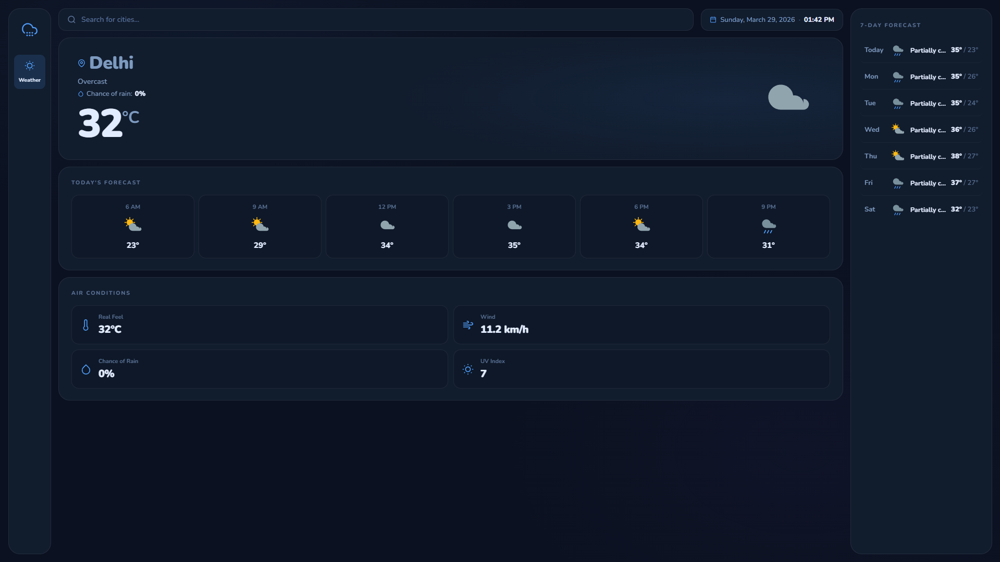

# 🌤️ Weather App

A clean, professional weather dashboard built with **React** and the **Visual Crossing Weather API**. Features real-time weather data, hourly forecasts, air conditions, and a 7-day outlook — all wrapped in a polished dark UI with smooth animations.


---

## ✨ Features

- **Real-time weather** — current temperature, conditions, feels like, wind, UV index, and rain probability
- **Hourly forecast** — 6-slot today's forecast with SVG weather icons
- **7-day forecast** — daily high/low with condition labels
- **Air conditions** — real feel, wind speed, rain chance, UV index
- **Dynamic hero orb** — animated sun, rain drops, thunder bolt, or cloud based on conditions
- **Live clock & date** — ticking clock updates every second
- **Error toast** — friendly notification when a city isn't found
- **Skeleton loaders** — shimmer placeholders while data loads
- **Fully responsive** — desktop sidebar, tablet top-bar, mobile bottom nav
- **Custom SVG icons** — no emoji, no icon library dependency

---

## 🖥️ Preview

```
Desktop  →  Sidebar | Main Content | 7-Day Panel
Tablet   →  Top Nav | Main Content | 7-Day Panel (below)
Mobile   →  Bottom Nav | Stacked Content
```

---

## 🛠️ Tech Stack

| Tech | Purpose |
|------|---------|
| React 18 | UI framework |
| Vite | Build tool & dev server |
| Visual Crossing API | Weather data |
| CSS Custom Properties | Theming & design tokens |
| SVG | Custom weather icons |

---

## 📁 Project Structure

```
src/
├── App.jsx                  # Root component — state, fetch logic, layout
├── App.css                  # Imports all style modules
│
├── utils/
│   └── weather.js           # Helper functions (formatTime, dayLabel, getOrbType, etc.)
│
├── components/
│   ├── WeatherIcons.jsx     # SVG icon set + getWeatherIcon() resolver
│   ├── Toast.jsx            # Error notification with auto-dismiss
│   ├── Sidebar.jsx          # App logo + navigation
│   ├── SearchBar.jsx        # City search input + live date/clock chip
│   ├── HeroCard.jsx         # Main weather display + animated orbs + empty state
│   ├── HourlyForecast.jsx   # Today's 6-slot hourly forecast
│   ├── AirConditions.jsx    # Real feel, wind, rain %, UV index
│   └── WeekForecast.jsx     # 7-day forecast panel
│
└── styles/
    ├── base.css             # Design tokens, body, animations, skeletons, toast
    ├── sidebar.css          # Sidebar, search bar, date chip
    ├── hero.css             # Hero card, orb animations, empty state
    ├── cards.css            # Hourly, air conditions, 7-day rows
    └── responsive.css       # Tablet (≤900px) and mobile (≤600px) breakpoints
```

---

## 🚀 Getting Started

### Prerequisites

- Node.js v18+
- A free [Visual Crossing](https://www.visualcrossing.com/) API key

### Installation

```bash
# 1. Clone the repository
git clone https://github.com/your-username/weather-app.git
cd weather-app

# 2. Install dependencies
npm install

# 3. Set up environment variables
cp .env.example .env
```

Open `.env` and add your API key:

```env
VITE_API_KEY=your_visual_crossing_api_key_here
```

### Running Locally

```bash
npm run dev
```

Open [http://localhost:5173](http://localhost:5173) in your browser.

### Building for Production

```bash
npm run build
```

---

## 🔑 Environment Variables

Create a `.env` file in the root of the project:

```env
VITE_API_KEY=your_visual_crossing_api_key_here
```

> ⚠️ Never commit your `.env` file. It's already in `.gitignore` by default with Vite.

To get an API key, sign up for free at [visualcrossing.com](https://www.visualcrossing.com/weather-api).

---

## 🎨 Design Highlights

- **Dark navy palette** with CSS custom properties for consistent theming
- **Mesh gradient background** using layered radial gradients
- **Glass-style cards** with subtle borders and backdrop depth
- **Condition-aware hero** — the background glow color shifts based on weather type
- **Staggered animations** — cards and items animate in sequentially on data load
- **Nunito font** for a friendly yet professional feel

---

## 📱 Responsive Breakpoints

| Breakpoint | Layout |
|-----------|--------|
| > 900px | Sidebar (left) + Main + 7-day panel (right) |
| ≤ 900px | Top navigation bar + stacked main + 7-day grid |
| ≤ 600px | Fixed bottom nav + fully stacked, scrollable hourly row |

---

## 🖥️ Preview



---
## 🙏 Acknowledgements

- Weather data by [Visual Crossing](https://www.visualcrossing.com/)
- Icons hand-crafted as inline SVGs
- Font: [Nunito](https://fonts.google.com/specimen/Nunito) via Google Fonts

---

## 📄 License

MIT © Harshit Patial